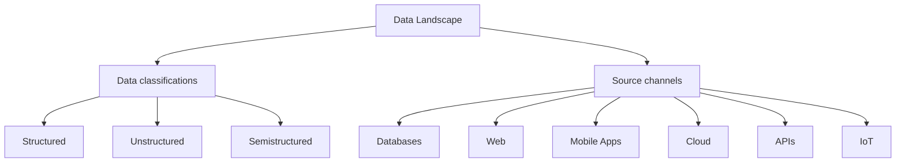

# Day 71 – BI Data Landscape Fundamentals

> This lesson expands the BI roadmap by grounding each data classification and source channel in real assets from the Coding-for-MBA repository.

## Why it matters

Understanding how structured, unstructured, and semi-structured sources flow into the BI stack ensures analysts can scope ingestion pipelines, negotiate requirements with engineers, and prioritize governance activities.

## Developer-roadmap alignment

## Classification reference table

| Section | Title | What to emphasize |
| --- | --- | --- |
| Data classifications | Types of data | Position the three major categories and when each surfaces in BI projects. |
| Data classifications | Structured | Highlight schemas, SQL queries, and data warehouse management. |
| Data classifications | Unstructured | Discuss text, audio, and other media that require NLP or transcription. |
| Data classifications | Semistructured | Connect JSON, XML, and log formats that straddle tables and documents. |
| Data classifications | What is Data? | Frame data as recorded facts produced by business processes. |

## Source channels mapped to repository datasets

| Source channel | Repository dataset | Format | Classroom talking point |
| --- | --- | --- | --- |
| Data Sources | `data/README.md` | md | Catalog that enumerates every example dataset students can explore. |
| Databases | `data/fortune1000_final.csv` | csv | Warehouse-style table for corporate benchmarking exercises. |
| Web | `data/hacker_news.csv` | csv | Community conversations scraped from the Hacker News website. |
| Mobile Apps | `data/result.csv` | csv | Behavior metrics analogous to exports from a product analytics SDK. |
| Cloud | `data/countries_data.json` | json | Semi-structured payload similar to what lands in cloud object storage. |
| APIs | `data/countries.py` | py | Lightweight client that mimics tapping into a REST Countries API. |
| IoT | `data/weight-height.csv` | csv | Sensor-like measurements from wearables or connected devices. |

## Next steps

- Run `python Day_71_BI_Data_Landscape/lesson.py` to preview the discussion tables.
- Pair each dataset with a lightweight notebook showing ingestion and profiling.
- Update stakeholder playbooks with the classification and sourcing vocabulary.
